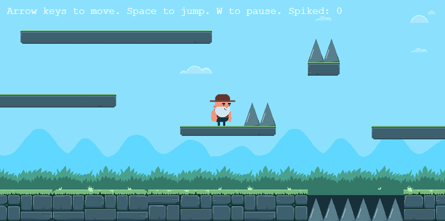

# Spelprodjekt


Projektet använder 
* [11ty](https://www.11ty.dev/) för att skapa html
* [Sass](https://sass-lang.com/) för att skapa css
* [Rollup](https://rollupjs.org/) för att kompilera javascript
* [Phaser 3](https://phaser.io/) som spelmotor
---
## Planering

### Task list

 - [x] Kuna lada in störe mapar 
 - [x] att pysiken och cameran fungerar på störe mapar
 - [x] att lada in andra mapar (next map)


### veko planering

 Vecka  |  Måndag  |  Onsdag  |  Fredag 
------- | -------- | -------- | ---------
 V. 48  | 1        | 1,2      | 4,5
 V. 49  | 5        | 4        | 5
 V. 50  | 5        |          | 
 V. 51  |          |          | 


1. lada test map
2. fixa pysiken och camera
3. hita bra camera instälningar
4. kuna lada in nesta karta (map)
5. implementera lavinens system/början på funktionen

---
## info
*spelet har bara **test** banao nu och inget som splet skule vara.*

speltiteln: 

vem: Milton

Tagline: 

Du är en nisse som gått rogue på färd för att slå emot tomtens hemska arbetsvillkor med enbart tiden som kan slå emot.

Description:

En platformer med jultema där många banor har någon form av tidspress genom samlandet av varm choklad innan man fryser eller att fly från en lavin. Leverera paket för extra poäng och förbered för en boss fight mot tomten i slutet.

Screenshot: 

URL: https://agitated-murdock-948596.netlify.app

GIT: https://github.com/NTIG-Umea/wu2-spel-miltonlundte19

Teamname: Furious-Zebras


```
{
    "team": "Furious-Zebras",
    "creators": "Milton Lund",
    "title": "",
    "description": "",
    "image": "milton-lund.png",
    "url": "https://agitated-murdock-948596.netlify.app",
    "git": "https://github.com/NTIG-Umea/wu2-spel-miltonlundte19",
    "survey": ""
}
```